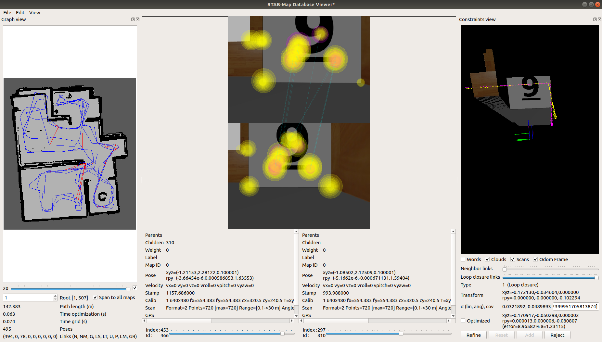

# Udacity Nanodegree: Robotics Software Engineer

## Project 04: Map My World

<p align="center">
    
    
</p> 

### Directory Structure

```
.RoboND_Map_My_World Inside "catkin_ws/src" # Project 04: Map My World
├── my_robot                                # my_robot package
│   ├── launch
│   │   ├── mapping.launch                  # Launch robot mapping (without rtabmapviz)
│   │   ├── localization.launch             # Launch robot localization (with rtabmapviz)
│   │   ├── robot_description.launch
│   │   └── world.launch                    # Launch empty world (with rtabmapviz)
│   ├── meshes
│   │   └── hokuyo.dae
│   ├── urdf
│   │   ├── my_robot.gazebo
│   │   └── my_robot.xacro
│   ├── worlds
│   │   ├── final_apt.world                 # The world for robot mapping and localization
│   │   └── ...                             # Other worlds I created
│   ├── CMakeLists.txt
│   └── package.xml
├── teleop_twist_keyboard                   # teleop_twist_keyboard package
│   ├── CHANGELOG.rst
│   ├── CMakeLists.txt
│   ├── package.xml
│   ├── README.md
│   └── teleop_twist_keyboard.py
└── CMakeLists.txt 
```

### How to run

#### 1. First of all, clone this repo:
```
git clone https://github.com/HanyuWu/RoboND_Map_My_World
```

#### 2. Launch the robot inside the world
This can be done by launching ```world.launch``` file:
```
$ cd RoboND_Map_My_World/catkin_ws/
$ catkin_make
$ source devel/setup.bash
$ roslaunch my_robot world.launch
```

#### 3. Run teleop node
In another terminal:
```
$ cd RoboND_Map_My_World/catkin_ws/
$ source devel/setup.bash
$ rosrun teleop_twist_keyboard teleop_twist_keyboard.py
```

#### 4. Launch RTAB-Map
In another terminal:
```
$ cd RoboND_Map_My_World/catkin_ws/
$ catkin_make
$ source devel/setup.bash
$ roslaunch my_robot mapping.launch
```

#### 4. (optional) Launch Robot Localization
After we got the [rtabmap.db](https://drive.google.com/file/d/1WfZKZcGskI86h2VEu_wZ_rFugoAbOwmd/view?usp=sharing), 
put the db file inside [catkin_ws/outputs](./catkin_ws/outputs).
```
$ cd RoboND_Map_My_World/catkin_ws/
$ catkin_make
$ source devel/setup.bash
$ roslaunch my_robot localization.launch
```
Download the map first when doing localization.

### For reviewers
Please download the [rtabmap.db](https://drive.google.com/file/d/1WfZKZcGskI86h2VEu_wZ_rFugoAbOwmd/view?usp=sharing), and put it inside [catkin_ws/outputs](./catkin_ws/outputs). Then you can run **rtabmap-databaseViewer** on the database file. 


